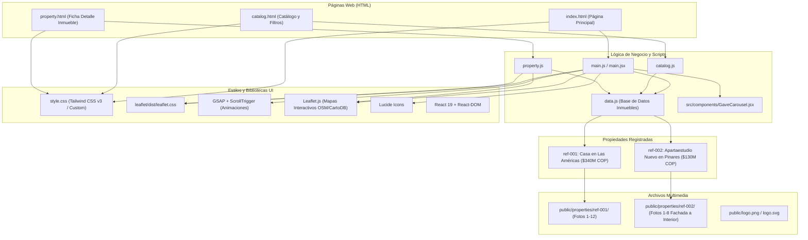

# PROJECT_MAP: Gave Propiedades

## 1. Arquitectura y Grafo del Proyecto

## 2. Descripción de Módulos y Nodos

- **`index.html` & `main.js`**:
  - Landing page institucional de Gave Propiedades.
  - Hero interactivo con llamada a la acción y animaciones GSAP.
  - Sección de Propiedades Destacadas (`ref-001` y `ref-002`) con fichas directas.
  - Mapa interactivo de cobertura con Leaflet.js centrado en las zonas activas.
  - Carrusel de equipo interactivo montado en React (`GaveCarousel.jsx`).
  - Secciones de servicios, testimonios, proceso de compra/venta y FAQ.

- **`catalog.html` & `catalog.js`**:
  - Buscador y catálogo completo con filtros dinámicos (Tipo: Casas, Apartaestudios, Apartamentos, Lotes; Habitaciones; Rango de área en m²; Ordenamiento por precio).
  - Renderizado reactivo desde `data.js` con estados vacíos y feedback visual.

- **`property.html` & `property.js`**:
  - Ficha técnica completa del inmueble obtenido por parámetro `?id=ref-XXX`.
  - Galería de imágenes interactiva organizada cronológicamente desde fachada exterior hacia áreas interiores.
  - Selector de imágenes con miniaturas y visualizador principal en alta resolución.
  - Reproductor de video tour integrado y modal lightbox a pantalla completa.
  - Mapa interactivo con Leaflet.js delimitando el radio de influencia y georreferenciación.
  - Botón de contacto directo por WhatsApp con mensaje preconfigurado con el título y referencia del inmueble.

- **`data.js`**:
  - Fuente única de la verdad con las propiedades publicadas:
    - `ref-001`: Casa en Sector Las Américas, Armenia (125 m², 3 hab, 3 baños, parqueadero cubierto, $340.000.000 COP).
    - `ref-002`: Apartaestudio Nuevo en Sector Pinares, Armenia (39 m², 1 hab, 1 baño, cocina integral, pisos en porcelanato, $130.000.000 COP).

- **`public/properties/ref-002/`**:
  - Imágenes ordenadas secuencialmente de afuera hacia adentro:
    - `foto_1.jpg`: Fachada principal exterior (Sobre vía principal).
    - `foto_2.jpg`: Entrada / Vista desde acceso exterior hacia área social.
    - `foto_3.jpg`: Sala y comedor integrados con pisos en porcelanato.
    - `foto_4.jpg`: Cocina integral moderna con gabinetes.
    - `foto_5.jpg`: Mesón de cocina, zona de ropas y patio interior.
    - `foto_6.jpg`: Habitación con closet empotrado e iluminación natural.
    - `foto_7.jpg`: Perspectiva interior de la alcoba.
    - `foto_8.jpg`: Baño completo con acabados modernos.

## 3. Despliegue y Hosting
- **Plataforma**: Surge.sh (`gave-propiedades-web.surge.sh` / `gave-propiedades-audit.surge.sh`)
- **Repositorio**: `github.com/RedbrickSeven8/gave-propiedades`
